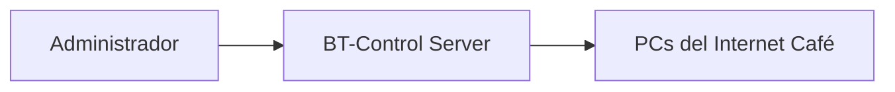

# BT-Controller


**BT-Control** es una herramienta diseñada para la administración de **Internet Cafés en entornos Linux**, proporcionando control básico de equipos, red y uso de estaciones.

---

# General Information

Este proyecto surge debido a la falta de soluciones actuales para la gestión de **Internet Cafés en Linux**.

La primera versión fue desarrollada en **Gambas**, sin embargo, el sistema está siendo **reescrito desde cero en Python** para mejorar su mantenimiento, compatibilidad y escalabilidad.

---

# Características

| Funcionalidad | Descripción |
|---|---|
| Control de estaciones | Administración de equipos conectados |
| Soporte de red | Funciona en redes inalámbricas (WiFi) y cableadas (Ethernet) |
| Configuración rápida | Instalación y puesta en marcha sencilla |
| Control básico | Gestión general del uso de equipos |
| Escalabilidad inicial | Soporte por defecto para 10 equipos |

---

# Detalles Técnicos

| Elemento | Descripción |
|---|---|
| Lenguaje | Python |
| Versión | Python 3.x (recomendado) |
| Plataforma | Linux |
| Red | WiFi / Ethernet |
| Capacidad | 10 PCs por defecto (expandible) |

> ⚠️ Nota: Se recomienda utilizar **Python 3** ya que Python 2 está obsoleto.

---

# Arquitectura



---

# Estado del Proyecto

| Fase | Estado |
|---|---|
| Versión Gambas | Finalizada |
| Reescritura en Python | En desarrollo |
| Control de estaciones | En desarrollo |
| Interfaz de usuario | Pendiente |

---

# Roadmap

| Versión | Funcionalidades |
|---|---|
| v0.1 | Reescritura base en Python |
| v0.2 | Control de estaciones |
| v0.3 | Interfaz básica |
| v0.4 | Control de sesiones |
| v0.5 | Administración completa |

---

# Uso del Sistema

BT-Control está orientado a:

- Internet Cafés
- Centros de cómputo
- Espacios públicos con acceso a internet
- Entornos educativos con múltiples equipos

---

# Instalación

## Requisitos

- Linux
- Python 3.x
- Red local (WiFi o Ethernet)

## Setup básico

```bash
git clone https://github.com/BT-Technologies/BT-Control.git
cd BT-Control
python3 main.py
```

---

# Licencia

Este software es **propietario**.

Su uso y distribución están restringidos sin autorización de:

**BT-Tech Developers Labs**

---

# Contacto

Para implementación o uso del sistema:

**BT-Tech Developers Labs**
